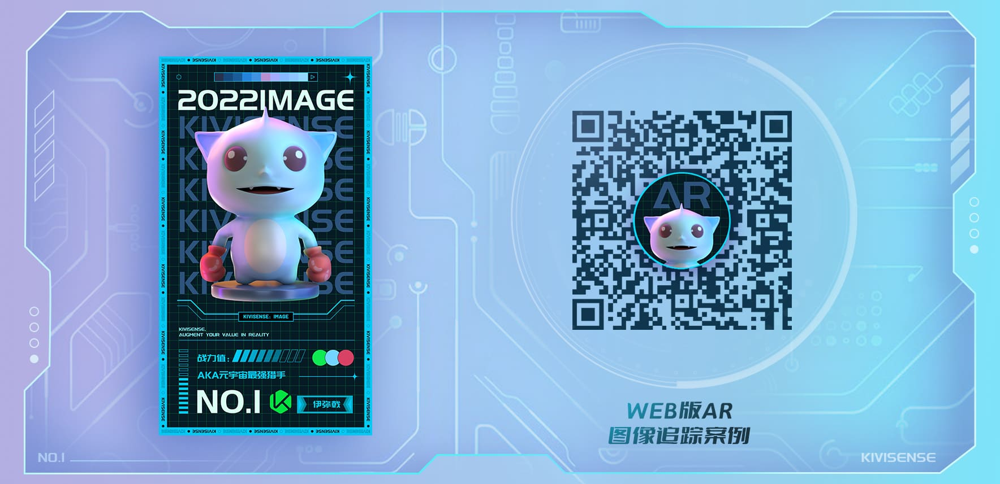
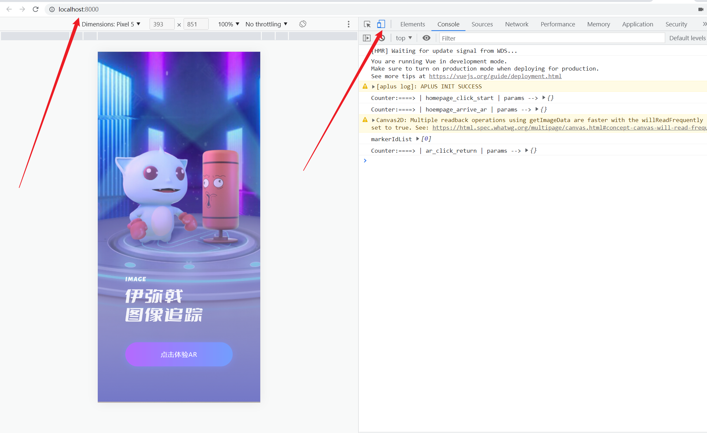

### 项目概述

本项目是 [Kivicube Web 版 AR 插件](https://www.yuque.com/kivicube/manual/web-ar-plugin-quick-start)的模板案例代码，是 [AR 裸眼插画案例](https://www.yuque.com/kivicube/manual/image-tracking)中【自研 H5 接入 AR】模块的示例代码

在 AR 裸眼插画案例中，开发者可以使用 [Kivicube 小程序 AR 插件](https://www.yuque.com/kivicube/manual/mp-ar-plugin-quick-start)完成微信小程序自定义开发，也可以参考本示例代码完成自研 H5 的自定义开发

请参阅[自研 H5 接入 AR](https://www.yuque.com/kivicube/manual/image-tracking#BEBke) 查看更多详情

### 体验项目

- 体验的 gif

  

- 识别图

  

### 项目运行准备

- 本项目只能在 localhost 运行，如果要发布到线上以及去除水印，请联系下方商务微信购买 Kivicube 企业版以及域名授权


- 更多定价详情请查看[定价详情-Web 版 AR 插件接入](https://www.yuque.com/kivicube/manual/kivicube-features#uYqPF)

### 项目运行

#### 运行项目

```bash
# 克隆项目
git clone git@github.com:kivisense/kivicube-web-plugin-cases.git

# 打开项目
cd web-image2d-tracking

# 安装依赖运行
# 建议node版本12

npm install
npm run start

#  yarn
#  yarn start
```

#### 目录说明

```bash
.
|
├── assets                        // 一些素材资源
|
├── components                    // 一些UI组件
│
├── pages                         // 页面
│    ├── home                     // 首页
│    ├── scene                    // kivicube-scene场景页面
│
├── utils                         // 一些工具方法
```

#### 注意

- 该项目会使用摄像头，请务必授权

- 引入说明

  该插件通过 iframe 的方式使用，需要先引入插件，在 pulic/index.html 中通过 script 标签引入，如下

  ```bash
    <script src="https://www.kivicube.com/lib/iframe-plugin.js"></script>
  ```

- 权限

  该项目目前只允许 <http://localhost:8000> 访问，打开`浏览器开发调试模式`,选择`移动端模式`运行

  

  ```bash
    # 注意只对外开放 8000 端口，不要修改端口号
    devServer: {
      port: 8000,
    }
  ```

  如果使用 ip 运行本项目，会在控制台会出现警告，如下，需要域名授权请联系官方客服

  ```bash
  Kivicube webPluginByIframe The domain of the hosting page is forbidding
  ```
