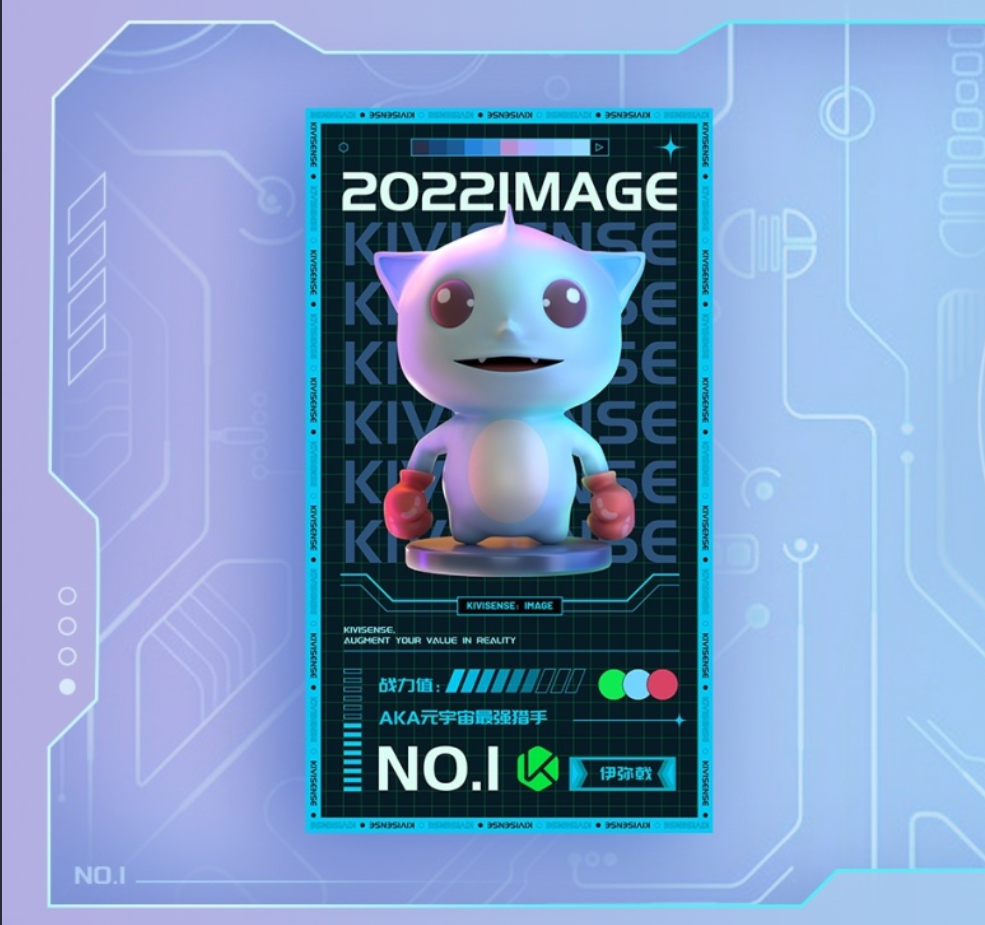

## 项目介绍

此项目是 web 使用 kivicube 插件的案例，以后会有更多案例陆续添加。

### web-image2d-tracking 案例

此案例是使用 kivicube-scene 制作裸眼 ar 识别海报的案例。给开发者提供了一个比较完整的示例和流程。

插件使用说明：https://mp.weixin.qq.com/wxopen/plugindevdoc?appid=wx3bbab3920eabccb2&token=&lang=zh_CN

快速接入插件文档地址：https://www.yuque.com/kivicube/manual/web-ar-plugin-quick-start#Z5vYQ

```bash
#克隆项目

git clone git@github.com:kivisense/kivicube-web-plugin-cases.git

#打开项目

cd web-image2d-tracking

#安装依赖运行

// 建议node版本12

npm install
npm run start

// yarn
// yarn start


#注意

该项目会使用摄像头，请务必授权

```

#### 目录说明

```bash
.
|
├── assets                        // 一些素材资源
|
├── components                    // 一些UI组件
│
├── pages                         // 页面
│    ├── home                     // 首页
│    ├── scene                    // kivicube-scene场景页面
│
├── utils                         // 一些工具方法
```

---

#### 说明

该插件在 pulic/index.html 文件中，通过 script 标签引入，如下

```
  <script src="https://www.kivicube.com/lib/iframe-plugin.js"></script>
```

#### 权限

该项目目前只允许 http://localhost:8000 访问，打开`浏览器开发调试模式`,选择`移动端模式`运行


// 注意只对外开放 8000 端口，不要修改端口号

```bash
  devServer: {
    port: 8000,
  }
```

#### 体验 AR

- 扫描下方图片


