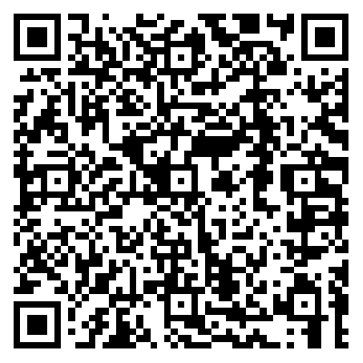

### 项目概述

此项目是 web 使用 kivicube 插件的案例，当用户已经具有自研 H5 页面，需要在该页面展示 AR 相关内容，并希望能够统计观看、使用 AR 的相关用户数据，则可以使用 kivicube web 版 AR 插件将制作好的 AR 嵌入到自研的 H5 页面，并进一步完善相关页面 UI。仅需使用浏览器，就可以获得丰富的 AR 体验。
本案例使用 web 版 AR 插件进行开发，复刻小程序 AR 图像追踪，展示出 web 版 AR 插件当前能实现的功能与局限性，其中场景制作部分与小程序 AR 图像追踪产品文档中展示的步骤完全相同，但整体页面功能等有所不同，因此研究本案例前可以打开小程序 AR 图像追踪及其相关产品文档进行对照参考。
同时，本案例使用友盟进行数据统计，参考相关内容，可以了解当前 web 版 AR 插件可以提供的用户信息收集领域，方便后续相关功能的设计与使用。

### 体验项目

- 使用手机扫描左边二维码 扫描下方右边图片体验




### 如何接入案例

- 此案例是使用 kivicube-scene 制作裸眼 ar 识别海报的案例。给开发者提供了一个比较完整的示例和流程。

- 在进行插件的接入前，需要先熟悉在 Kivicube 平台上进行 AR 场景的创建

插件使用说明：

<https://mp.weixin.qq.com/wxopen/plugindevdoc?appid=wx3bbab3920eabccb2&token=&lang=zh_CN>

快速接入插件文档地址：

<https://www.yuque.com/kivicube/manual/web-ar-plugin-quick-start#Z5vYQ>

- 如果需要去除水印，请联系商务购买 Kivicube 企业版

### 运行项目

```bash
#克隆项目

git clone git@github.com:kivisense/kivicube-web-plugin-cases.git

#打开项目
cd web-image2d-tracking

#安装依赖运行
# 建议node版本12

npm install
npm run start

#  yarn
#  yarn start
```

#### 目录说明

```bash
.
|
├── assets                        // 一些素材资源
|
├── components                    // 一些UI组件
│
├── pages                         // 页面
│    ├── home                     // 首页
│    ├── scene                    // kivicube-scene场景页面
│
├── utils                         // 一些工具方法
```

#### 注意

- 该项目会使用摄像头，请务必授权

- 引入说明

该插件通过 iframe 的方式使用，需要先引入插件，在 pulic/index.html 中通过 script 标签引入，如下

```bash
  <script src="https://www.kivicube.com/lib/iframe-plugin.js"></script>
```

- 权限

该项目目前只允许 <http://localhost:8000> 访问，打开`浏览器开发调试模式`,选择`移动端模式`运行


```bash
  # 注意只对外开放 8000 端口，不要修改端口号
  devServer: {
    port: 8000,
  }
```

如果使用 ip 运行本项目，会在控制台会出现警告，如下，需要域名授权请联系官方客服

```bash
Kivicube webPluginByIframe The domain of the hosting page is forbidding
```

客服微信


