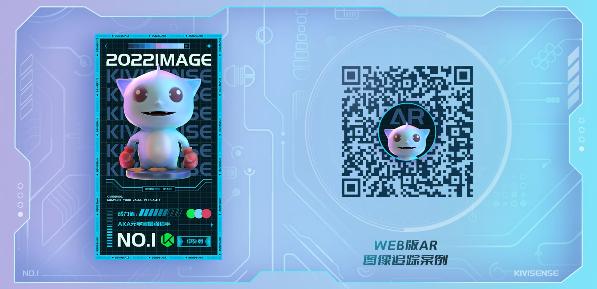
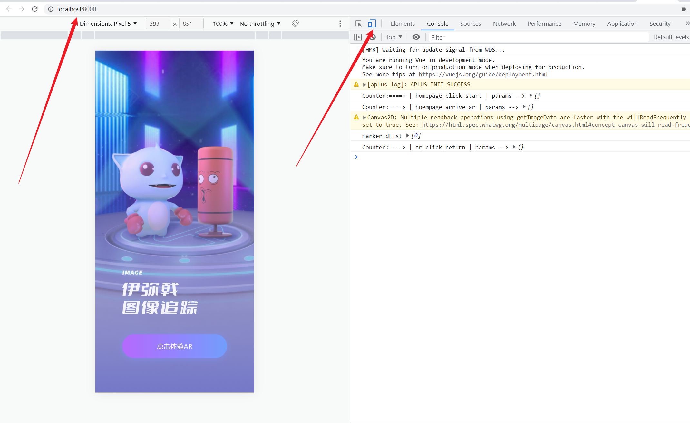

### Project Overview

[中文版](./README-CN.md)

This project is a template case for the [Kivicube Web AR Plugin](https://www.yuque.com/kivicube/manual/web-ar-plugin-quick-start), and serves as the sample code for the **Custom H5 AR Integration** module in the [AR Illustration Tracking Case](https://www.yuque.com/kivicube/manual/image-tracking).

In the AR Illustration Tracking case, developers can use the [Kivicube Mini Program AR Plugin](https://www.yuque.com/kivicube/manual/mp-ar-plugin-quick-start) for custom WeChat Mini Program development, or refer to this sample code for custom H5 development.

Please refer to [Custom H5 AR Integration](https://www.yuque.com/kivicube/manual/image-tracking#BEBke) for more details.

### Demo

- Demo GIF

  

- Tracking Marker

  

### Prerequisites

- This project can only run on localhost. To deploy online or remove the watermark, please contact the business WeChat below to purchase Kivicube Enterprise Edition and domain authorization.


- For more pricing details, please refer to [Pricing - Web AR Plugin Integration](https://www.yuque.com/kivicube/manual/kivicube-features#uYqPF).

### Getting Started

#### Run the Project

```bash
# Clone the repository
git clone git@github.com:kivisense/kivicube-web-plugin-cases.git

# Navigate to the project
cd web-image2d-tracking

# Install dependencies and run
# Recommended Node.js version: 12

npm install
npm run start

#  yarn
#  yarn start
```

#### Directory Structure

```bash
.
|
├── assets                        // Static resources
|
├── components                    // UI components
│
├── pages                         // Pages
│    ├── home                     // Home page
│    ├── scene                    // Kivicube scene page
│
├── utils                         // Utility functions
```

#### Notes

- This project requires camera access. Please make sure to grant the permission.

- Import Instructions

  The plugin is used via iframe. You need to import the plugin first by adding a script tag in `public/index.html` as follows:

  ```html
  <script src="https://www.kivicube.com/lib/iframe-plugin.js"></script>
  ```

- Permissions

  This project currently only allows access from <http://localhost:8000>. Open your browser's **Developer Tools** and switch to **Mobile Device Mode** to run.

  

  ```bash
  # Note: only port 8000 is open, do not change the port number
  devServer: {
    port: 8000,
  }
  ```

  If you run this project using an IP address, a warning will appear in the console as shown below. For domain authorization, please contact the official customer service.

  ```bash
  Kivicube webPluginByIframe The domain of the hosting page is forbidding
  ```
